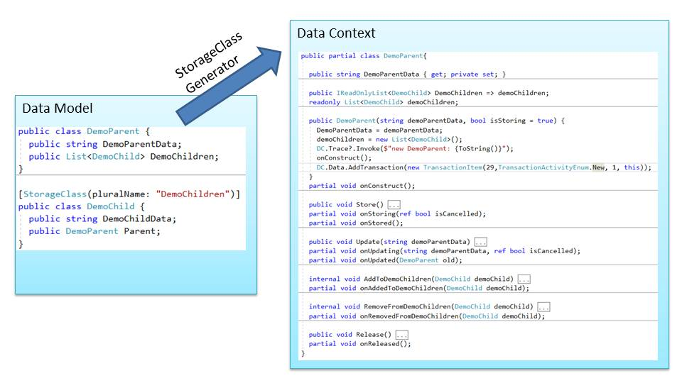

# *Storage is now replaced by https://github.com/PeterHuberSg/Storagelib*

No further develoment of Storage project

# Introduction
Storage is a C# only library for lightening fast object oriented data storage in RAM and 
long term storage on local Harddisk. No database required.

**Main features**
* object oriented data storage in RAM using collections for parent child relationships
* flat file storage per class in CSV file for permanent storage (optional)
* create, store, update and release (CRUD) operations
* transactions (start, rollback and commit transaction)
* fast backup at application start if necessary
* fast compacting of files at application end
* detailed tracing for debugging
* maximum data size depends on available RAM
* High speed: 30'000 transactions per second including permanent storage
* ideal for single user applications
* Class files can be read and manipulated with any Editor

Using a database for single user applications just to store data permanently is overkill, adds 
a lot of unnecessary complexity and slows down the program execution.

Nowadays PC have lots of RAM. For many single user applications is it possible to keep all the data in RAM and to do queries using Linq, 
which leads to much faster programs than interfacing with a "slow" database. Also the mismatch between data types in DotNet and databases
can be avoided.

To store the data permanently, it's enough to write them into local files. This can be done using UTF8 instead of binary, which
makes it easy to inspect and edit these files with any Editor, but the storage requirement is not much bigger. Storing '1234567' as string
takes the same space (7 bytes plus delimiter) like storing it as 8 byte binary.

This library contains high performance Readers and Writers for CSV ('comma' separated values) files and a code generator for the 
object related data model in RAM, using .Net Core 3.1.

# Code Usage
The Storage library comes with a code generator. It reads classes with properties from a source
directory and writes new classes with the same properties and the 
abilities to write to and to read from CSV file into the target directory.

**Project StorageModel: Source directory**  
StorageModel.cs: contains all simple classes like Sample, SampleDetail, ...  
Program: A console application running the code generator

**Project StorageClassGenerator**  
code generator

**Project StorageDataContext: Target directory**, contains the generated files  
Sample.cs: Partial class, gets created once, contains code which is not from the generator  
Sample.base.cs: Partial class, gets recreated every time the generator runs.  
The generator also creates a data context, which holds all the StorageDictionaries. The
name of this .cs file is configurable.

**Project Storage**  
Contains code similar like dictionary, but with the ability to write its content to and read 
it back from a CSV file.

**Project StorageTest**  
Unit tests for Storage

# Further Documentation
[Manual.md](Manual.md) describes the design of Storage and how to use it (work in progress).

See file StorageModel.cs in the project StorageModel for a description how to setup your 
application to define the data model, generate your classes and use them from your 
application.

# Project Status
Coding completed and tested  
Used in one application, a second application is presently in work.
Please note that new functionality gets continuously added.
 

